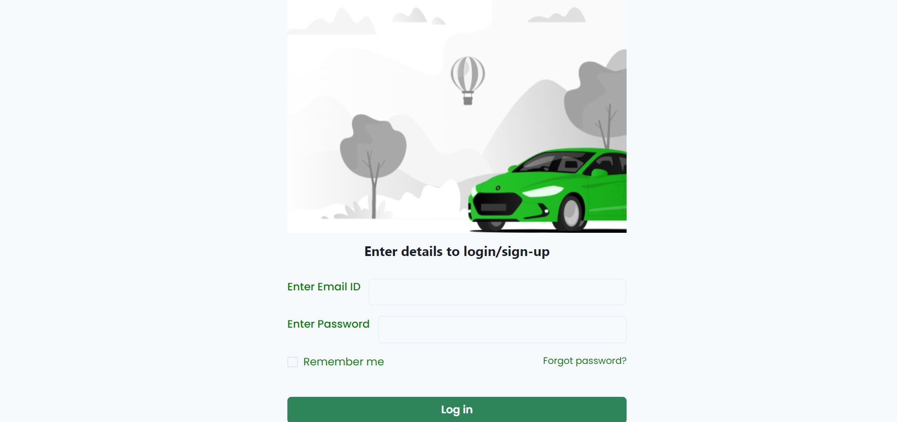
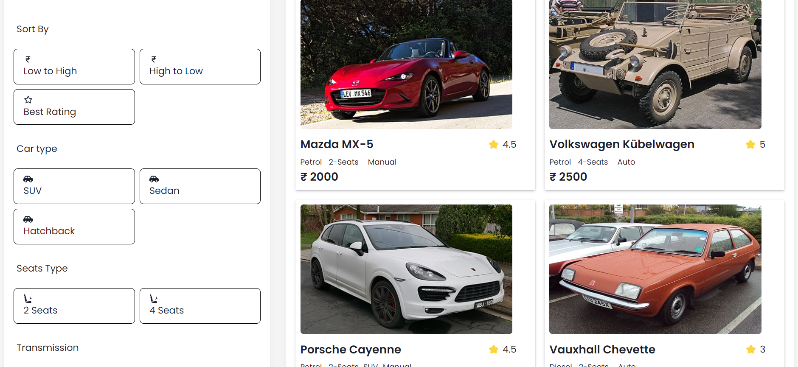
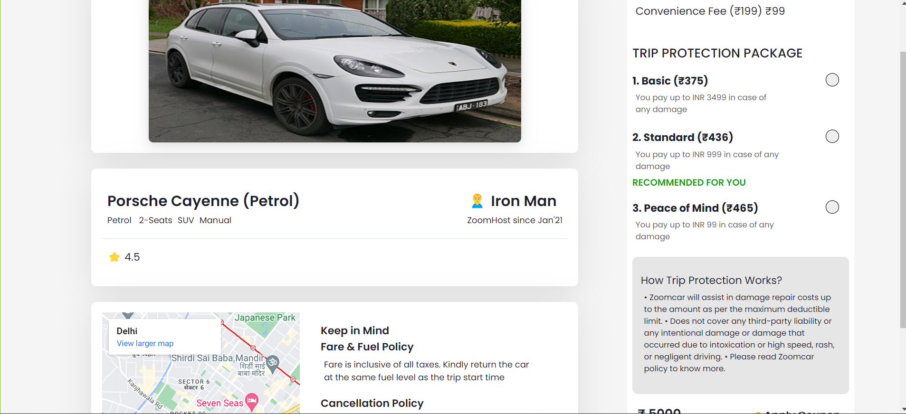
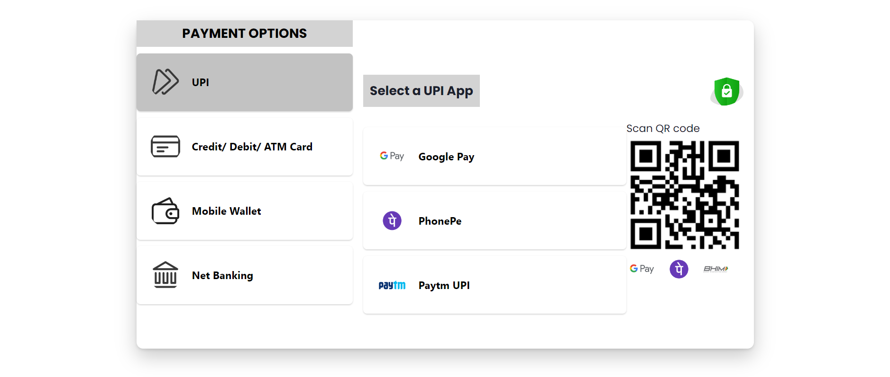
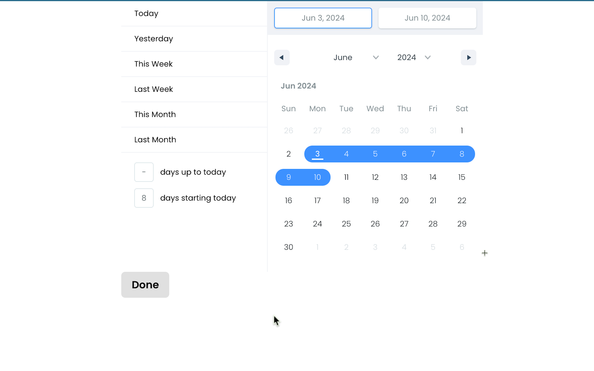
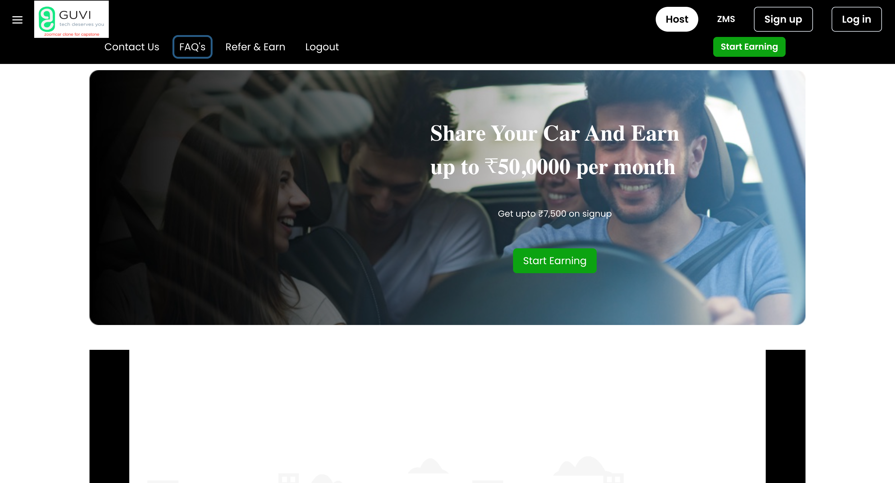

## Working on Zoomcar clone....

<h1>Landing Page</h1>
 

` `

<h1>Login Page</h1>
 

 
<h1>Cars Page</h1>
 

` `

<h1>Single Car Page</h1>
 

` `

<h1>Payment Page</h1>
 

` `

<h1>Date Page</h1>
 

` `

<h1> Host Page</h1>
 

` `

<B> WALK AROUND ON BELOW THING </B>
- Navabr, sidebar, Landingpage,HostPage,DatePage,Routing,Responsiveness
 
 
 
  SignupPage, LoginPage,PrivateRouting,Routing,Responsiveness
 
 
 
Cars Page (sorting and filter functionality),SingleCarPage
Process to pay page - This page is Private Page Means Protected without login can't access,
LocationPage,Routing,Responsiveness
 
 
 
  Payment page, Process to pay page with location thing,Routing,Responsiveness
 
 
 
<h3>Thank You 🙂
